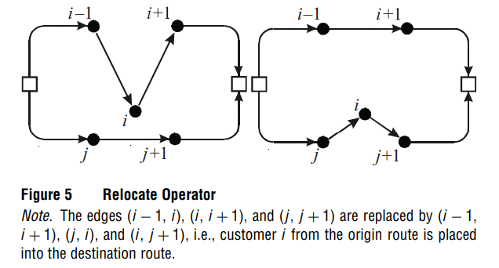

# An efficient array oriented implementation of memetic algorithm to solve variants of VRPs

Memetic algorithm is basically a genetic algorithm enhanced by local search. 

The choice of data structures to represent the solution of VRPs can significantly affect the run time. A few points
must be considered below:

* insertion operation
* deletion operation
* neighborhood constrained by an angle
* 
## Array Oriented Route Representation

